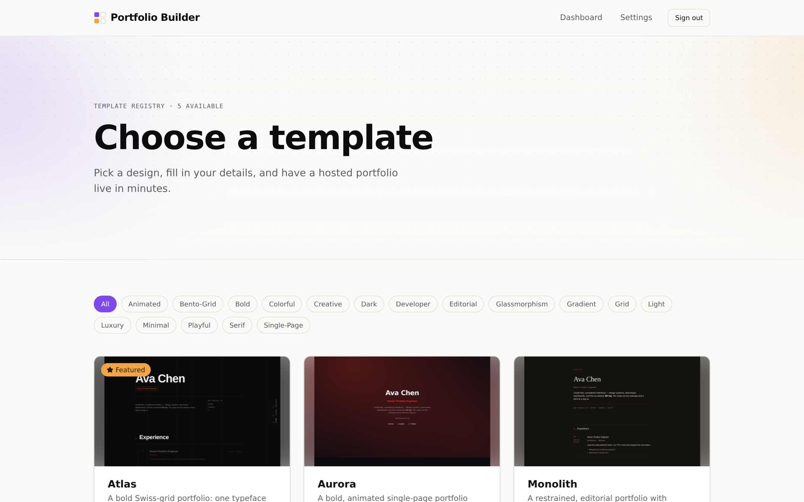
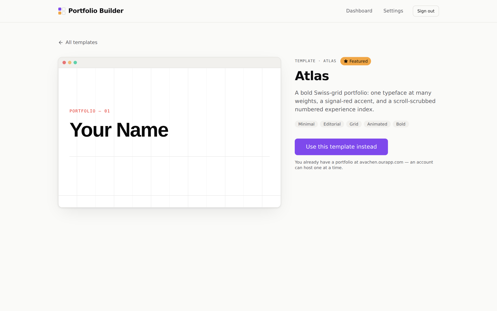
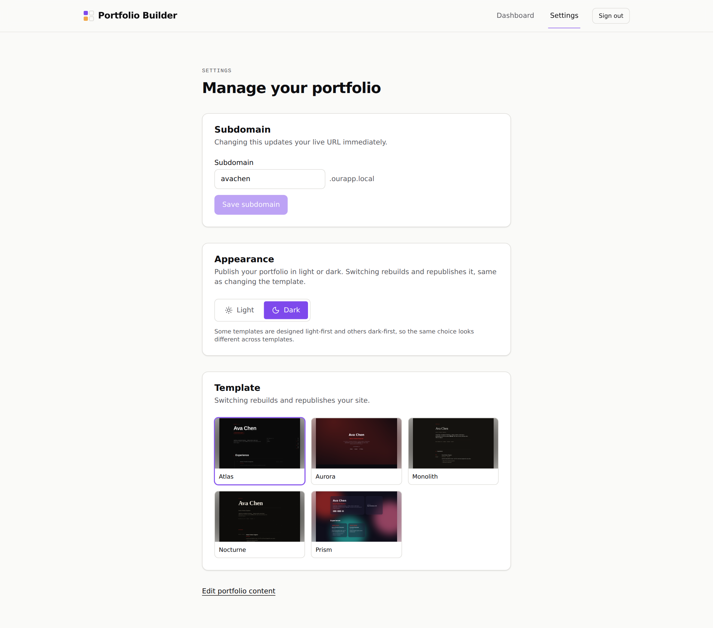
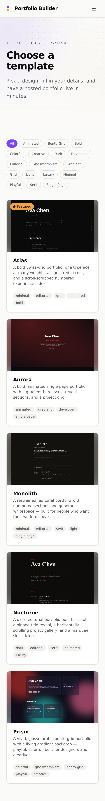
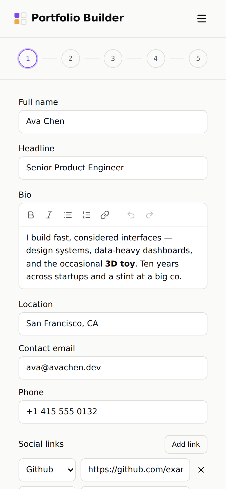
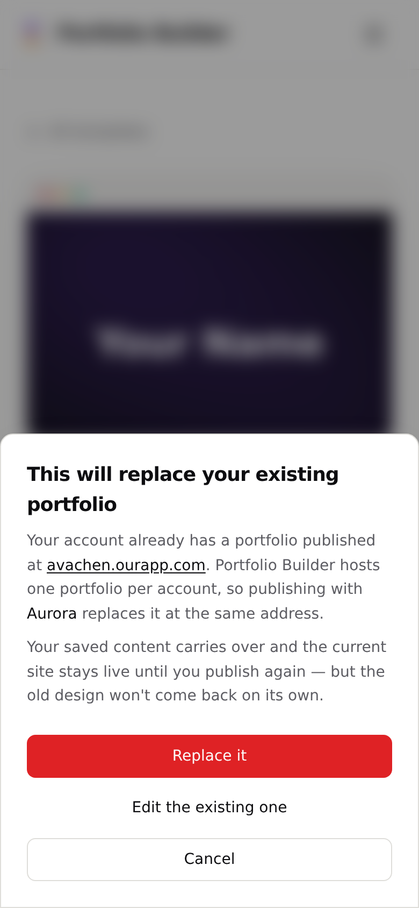
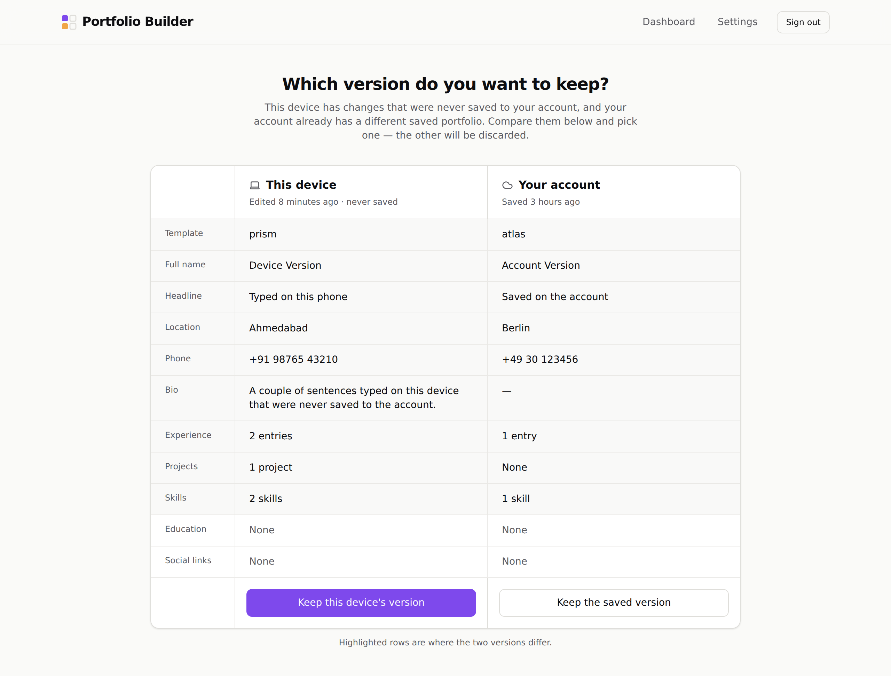
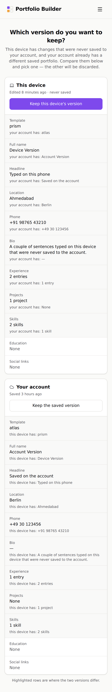

# Portfolio Builder — Web App

Pick a template. Fill in your details. Get a hosted portfolio at
`you.ourapp.com` in minutes, or download a real Vite + React project
and deploy it anywhere.

<p align="center">
  
</p>

React 19 + Vite 8 (Rolldown) + React Compiler + Tailwind v4. Talks to
[`portfolio-builder-api`](https://github.com/darshan260802/portfolio-api)
for auth, profile storage, and the build/publish pipeline. Renders
templates from
[`@pb/templates`](https://github.com/darshan260802/portfolio-templates).

---

## What it does

- **Browse a small, opinionated gallery of five templates** — each one is
  a real, animated site (GSAP + Motion), not a static image. The gallery
  loads them in an isolated iframe so their code never touches the
  builder bundle.
- **A five-step wizard** — Basics → Experience → Projects → Skills →
  Review — with a **live preview** panel that reflects every keystroke
  and previews desktop, tablet, or phone widths. The whole wizard state
  is validated against the shared Zod schema from `@pb/templates`, so
  "valid on the client" and "valid on the server" can't drift.
- **Publish to `you.ourapp.com`** — one click; a real Vite build runs
  server-side, gets deployed with atomic symlinks, and the URL is yours.
- **Or export the ZIP** — a fully working Vite + React project with your
  data baked in. `bun install && bun run build` and it's ready for any
  static host.
- **Rename, restyle, replace** — Settings lets you rename the subdomain,
  toggle the published portfolio between light and dark, or switch
  templates entirely. Every option rebuilds and republishes.

## Feature highlights

| Feature | What it does | Why it exists |
|---|---|---|
| **Live preview iframe** | A postMessage protocol streams every wizard change into a `<iframe src="/preview.html?template=…">` running the real template. | Keeps template code (and its global CSS) out of the builder bundle. Rolldown code-splits along the two-entry graph — proven by inspecting the built chunks. |
| **Draft persistence across auth** | The in-progress wizard lives in `localStorage` (Zustand + `persist`). | You can pick a template while logged out, get bounced through OAuth, and land back on `/create` with everything intact. |
| **Draft-conflict prompt** | Detects when the local draft AND the account both have real, differing content and asks which to keep, showing the two side by side. | Two devices editing the same account no longer silently overwrite each other. Mobile stacks it into one card per version so both "Keep" buttons are reachable. |
| **Overwrite guard** | Attempting to publish over an existing site (or entering the wizard from a template while a site is already live) opens a confirm dialog naming the current URL. | An account hosts exactly one portfolio; previously the only signal was the live site changing under you. |
| **Cache buster** | Every build stamps an id into `<meta name="pb-build-id">` and `version.json`. The client polls, compares against the loaded document, and force-reloads on mismatch. `bun run cachebust` rewrites both to force everyone off cache without a rebuild. | Vite hashes assets but a stale `index.html` maps the app onto old filenames — the classic bug where fixes exist but users don't see them. |
| **Featured badge** | A small star pill sits over any template flagged in `src/features/gallery/featured.ts`. | Editorial highlight for new templates — never bakes into an exported portfolio. |
| **Consistent thumbnails** | One `TemplateThumbnail` component: every image renders `object-contain` over a blurred, scaled copy of itself. | Some thumbnails are square, some are 16:9; a plain `object-cover` frame silently cropped the square ones and made them read as a different set. |

## Who it's for

- Engineers and designers who want a hosted portfolio in an hour, not a
  weekend, but still want it to look real.
- Anyone who wants to own their portfolio — hit **Download** and every
  file is yours, no proprietary format, no lock-in.
- Teams building on top: the wizard + API + template contract is a
  clean example of how to keep user data, template rendering, and
  publishing infrastructure separated.

## What it looks like

### Gallery and template detail

<table>
  <tr>
    <td width="50%">
      
      <p align="center"><em>Gallery — real captured thumbnails, tag filter, Featured pill on Atlas.</em></p>
    </td>
    <td width="50%">
      
      <p align="center"><em>Detail — live iframe of the template with empty data, sticky info panel.</em></p>
    </td>
  </tr>
</table>

### Wizard with live preview

<p align="center">
  
</p>

### Settings — rename, restyle, or switch templates

<p align="center">
  
</p>

### Mobile — no compromise

<table>
  <tr>
    <td width="33%">
      
      <p align="center"><em>Gallery.</em></p>
    </td>
    <td width="33%">
      
      <p align="center"><em>Wizard — location/email/phone stack cleanly at 375px.</em></p>
    </td>
    <td width="33%">
      
      <p align="center"><em>Overwrite confirm — bottom sheet on phones.</em></p>
    </td>
  </tr>
</table>

### Draft-conflict chooser (this device vs. your account)

<table>
  <tr>
    <td width="60%">
      
      <p align="center"><em>Desktop — side-by-side grid, differences highlighted.</em></p>
    </td>
    <td width="40%">
      
      <p align="center"><em>Mobile — stacked cards, each with its own choice button.</em></p>
    </td>
  </tr>
</table>

---

## Setup

```sh
bun install
cp .env.example .env   # only needed if the API isn't on localhost:3000
bun run dev
```

`@pb/templates` ships from
[`portfolio-templates`](https://github.com/darshan260802/portfolio-templates)
as a `github:` dependency with its `dist/` committed, so `bun install`
never runs a build.

### Env vars

| Var | What it is | Default |
|---|---|---|
| `VITE_API_URL` | Where `portfolio-builder-api` is running. | `http://localhost:3000` |
| `VITE_PORTFOLIO_DOMAIN` | The domain user sites are served from — shown as `.<domain>` next to the subdomain field. | `ourapp.local` |
| `VITE_BUILD_ID` | Optional. Pins the cache-buster stamp to something meaningful (e.g. a git SHA). Otherwise a fresh id is generated per build. | (auto) |

### Scripts

| Script | What it does |
|---|---|
| `bun run dev` | Vite dev server on `:5173`, with the version-check middleware serving `/version.json` in memory. |
| `bun run build` | `tsc -b && vite build` — writes `dist/` (see [Cache busting](#cache-busting) for the stamp). |
| `bun run cachebust [--dir <web root>] [--id <id>]` | Rewrites `<meta name="pb-build-id">` and `version.json` in place. No rebuild. See [Cache busting](#cache-busting). |
| `bun run preview` | Serve the built `dist/` on `:4173`. |
| `bun run typecheck` | `tsc -b --noEmit`. |
| `bun run lint` | `oxlint`. |

## Two entries, one isolation guarantee

- `index.html` → `src/main.tsx` — the builder app (gallery, wizard,
  dashboard, settings). Imports only `@pb/templates`' schema and
  `TEMPLATES` metadata — never a template's component code.
- `preview.html` → `src/preview.tsx` — an isolated iframe entry. The
  **only** file allowed to import `@pb/templates/loaders` (the static
  `{ id: () => import(...) }` map — a dynamic template-literal import
  can't be code-split by Rolldown, hence the generated static map).

This is what keeps template code and template global CSS out of the
builder bundle. `src/features/preview/PortfolioPreview.tsx` is the
parent side of the protocol: `<iframe src="/preview.html?template=…">`
and `pb:ready`/`pb:data` postMessages.

**Verified, not just designed:** a real `vite build` was run and the
output inspected — the builder's `main`/`core` chunks contain zero
template-specific strings, and the aurora template chunk is reachable
only from `preview.html`'s graph. The rendered preview was also loaded
in a real browser with a clean console.

## `resolve.dedupe` — read before touching template dependencies

`vite.config.ts` sets `resolve.dedupe: ["react", "react-dom"]`. This is
load-bearing, not cosmetic: `@pb/templates` is a `file:`/symlinked
dependency, and its `dist/aurora/index.js` imports
`react/compiler-runtime` — React 19's own CJS compiler-runtime helper.
Without `dedupe`, Vite realpath-resolves that import through the symlink
into the **templates repo's own** `node_modules/react`, producing a
second React instance with its own internals singleton. The compiler
runtime's `useMemoCache` then reads a dispatcher that react-dom never
set (it only sets it on the copy it renders with) — every compiled
template component throws `Cannot read properties of null (reading
'useMemoCache')` on mount.

## Cache busting

Vite content-hashes every JS/CSS asset, so those are safe to cache
forever. `index.html` is the one file that must never be cached — it's
what maps "the app" onto the current hashed filenames. When something
serves a stale one anyway (a CDN, a proxy, the browser's own HTTP
cache), the user keeps running old code with no symptom except bugs
that were already fixed.

Two halves close that:

1. **Every build is stamped.** `vite.config.ts`'s `buildStamp` plugin
   puts the same id in two places: a `<meta name="pb-build-id">` in
   `index.html`, and `version.json` at the web root.
   `src/lib/version-check.ts` compares them on load, on every return to
   the tab, and every five minutes; a mismatch means the document came
   out of a cache, so it clears Cache Storage / service workers and
   reloads to a one-shot `?pb_v=…` URL. The reload fetches a fresh
   document, so the two sides necessarily agree afterwards — the check
   can't loop. (In-progress wizard content lives in localStorage, so a
   forced reload doesn't lose it.) Set `VITE_BUILD_ID` to pin the
   stamp, e.g. `VITE_BUILD_ID=$(git rev-parse --short HEAD) bun run build`.
2. **One command to force it.** A normal deploy needs nothing extra —
   the new build's own id is what makes open tabs reload. When the
   files are already right but people are still being served an old
   document, run:

   ```sh
   bun run cachebust                 # re-stamps ./dist
   bun run cachebust --dir /srv/app  # or a deployed web root, in place
   ```

   It rewrites the stamp in `index.html` and `version.json` together,
   so every cached document mismatches and reloads once. Hashed assets
   are deliberately untouched — their filenames are their cache keys.

For any of this to work, the server must not cache `index.html` or
`version.json`. With nginx:

```nginx
location / { try_files $uri $uri/ /index.html; }
location = /index.html { add_header Cache-Control "no-store"; }
location = /version.json { add_header Cache-Control "no-store"; }
location /assets/ { add_header Cache-Control "public, max-age=31536000, immutable"; }
```

Note what `try_files $uri $uri/` implies for `public/`: anything in
there shadows the client route of the same path. A `public/templates/`
folder made `$uri/` match a real directory for `/templates/aurora`, so
a direct load or refresh of a template page got a 403 from the directory
instead of the app. Don't add a `public/` entry whose name collides
with a route in `src/routes/index.tsx`.

## Structure

```
src/
  main.tsx / preview.tsx    the two entries
  routes/                   route table
  features/
    gallery/    auth/    wizard/    preview/    deploy/    settings/    dashboard/
  components/ui/            small shadcn-style primitives (Button, Input, Card, ConfirmDialog, TemplateThumbnail, …)
  lib/                      api.ts, auth-client.ts, draft-store.ts, env.ts, version-check.ts, utils.ts
scripts/
  cachebust.ts              re-stamps a built web root without rebuilding
```

`lib/draft-store.ts` (zustand + localStorage) is what makes the
"pick a template while logged out → OAuth round-trip → land back on
/create with that template and any typed-so-far content" flow survive a
full-page redirect — it's not React state, so it's still there after
the page reloads.

## Real bugs found and fixed during verification

Bugs surfaced only by actually running the built app in a browser —
none would have been caught by `tsc`/lint alone:

1. **Blank page after Home → template → Create.** `Layout` wraps
   `children` in `<AnimatePresence mode="wait">`, and `children` was a
   bare `<Routes>` (reading the live location). The outgoing copy
   re-rendered as the incoming route (mounting `RequireAuth` +
   `CreatePage` inside the exiting element), motion never completed the
   exit, and the one `<main>` parked at `opacity: 0`. Fix: pass
   `location` explicitly to `<Routes>` so the outgoing copy renders the
   page being left; hoist motion prop objects to module constants so a
   Layout re-render doesn't restart an in-flight animation.
2. **`/templates/aurora` 403 on refresh.** `public/templates/` shadowed
   the SPA route under the standard `try_files $uri $uri/ /index.html`.
   Removed — the folder was unreferenced; thumbnails come from each
   template's manifest.
3. **`resolve.dedupe` for React** (see above).
4. **Vite lib mode CSS naming** in the templates package — the built JS
   imported `./Template.css` while the file was renamed to
   `./index.css`; the templates build script patches the import.
5. **Rich-text editor click area.** Tailwind arbitrary-variant
   `[&_.rich-text-editor__content]` converted the literal underscore
   into a space — the selector never matched, the editable area
   rendered at content height, and most of the visible box was
   unclickable. Moved to plain CSS.

## Known gap

Not exercised end-to-end here: the full auth → wizard → deploy flow
against a live API + Postgres (none available in this environment —
see `portfolio-builder-api`'s README). What's verified: the app
renders, routes, and settles correctly on every navigation; the
template preview pipeline works in a real browser; the overwrite
guards fire in the right places; the cache buster reloads a stale
document exactly once; and the whole module graph type-checks and
builds cleanly.
